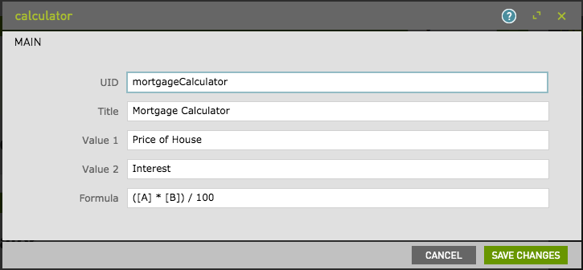
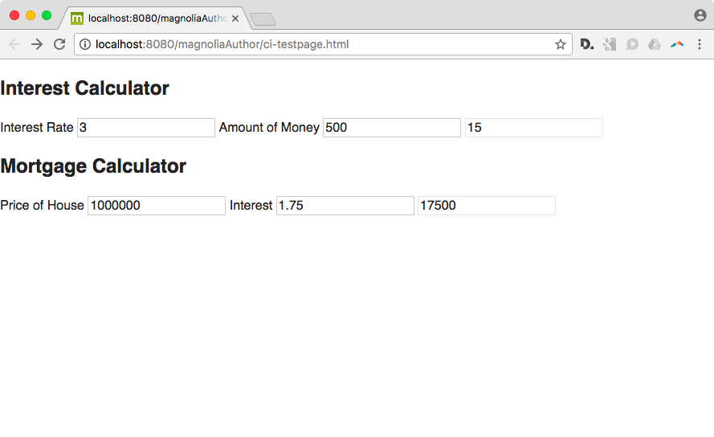

[](https://travis-ci.org/robertkowalski/mgnl-calculator)

# mgnl-calculator

Small calculator built with webpack.


## Features

Customizable formula and form fields. Supports different ids for multiple instances on one page.





## Usage

Depends on jQuery 3.x

After installation, add this to your page template:

```
<script src="https://ajax.googleapis.com/ajax/libs/jquery/3.1.1/jquery.min.js"></script>
<script src=".resources/mgnl-calculator/webresources/bundle.js"></script>

```


## Tests

### Fixture Setup

Fixture was exported from Magnolia using the "Export"-functionality of the UI

### JS Unit Tests

Unit tests are using Jest as test runner, as it supplies a DOM environment

### Template / Integration tests

Tests are super simple and based `cheerio`. Mocha is used as test runner

### Travis

Main test step in Travis executes `npm test`

Setting up the Magnolia server is done with the `before_script` hook.


## Information on Magnolia CMS

This directory is a Magnolia 'light module'.
https://docs.magnolia-cms.com


## License

MIT
